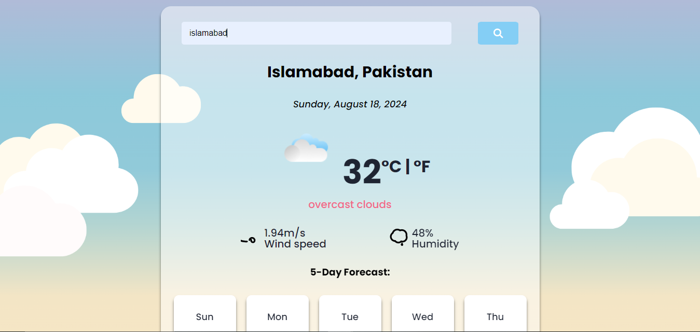

# React Weather App

This is a web app developed as a intership task1 project given form VerveBridge in which i used React.js. It allows users to search for the weather conditions of any city in the world and provides current weather information. The app fetches weather data using the SheCodes Weather API.

<h2 align="center">
  <a href="https://React-Weather-App-faseeh.vercel.app/" target="_blank">React-Weather-App-Faseeh.vercel.app</a>
</h2>

  
  

# Features

- Users can search for weather conditions of any city in the world.
- The app displays the current weather conditions, including temperature and weather description.
- The app utilizes the SheCodes Weather API to fetch weather data.

# Technologies & Tools Used

- React.js
- HTML
- CSS
- JavaScript
- VS Code
- SheCodes Weather API

# Installation and Usage

To use this app, you can follow these steps:

- Clone the repository or download the source code.
- Open the project in your preferred code editor.
- Run `npm install` to install the necessary dependencies.
- Run `npm start` to start the development server.
- Open your browser and navigate to `http://localhost:3000` to use the app.

To use the app, simply type the name of the city you want to search for in the search bar and press Enter. The app will display the current weather conditions for the searched city.

# Demo

A live demo of the React Weather App is available at [LINK TO LIVE DEMO](https://React-Weather-App-faseeh.vercel.app/).

# Credits

- The weather app was created by [M.Faseeh Hassan](https://github.com/faseeh41) as a intership task1 project given form VerveBridge for React workshop.
- The app uses the SheCodes Weather API to retrieve weather data.

### Show your support

Give a ⭐ if you like this website!

